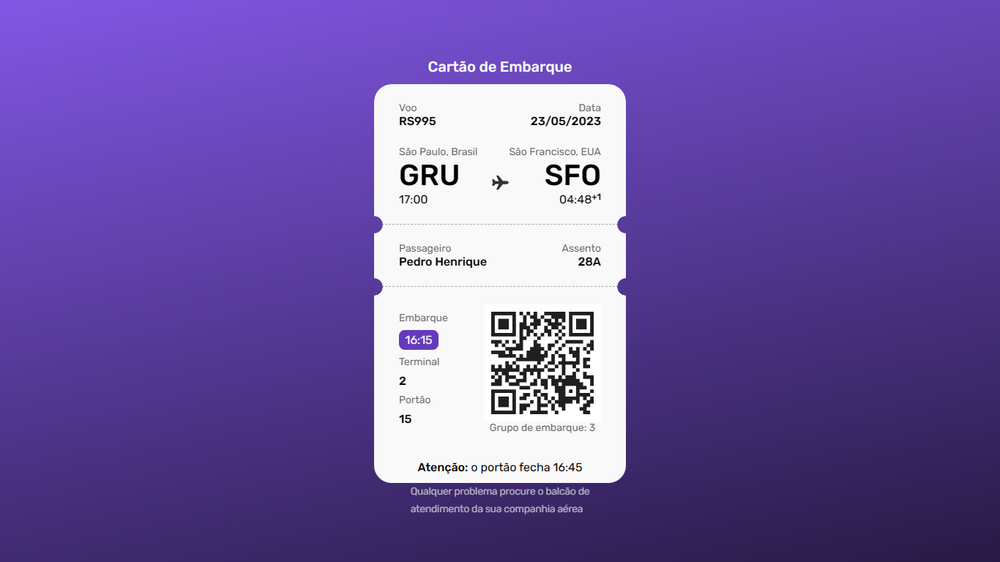

# Cartão de Embarque

Projeto criado com intuito de replicar um vouncher de embarque de viajens


## HOME 




## 🚀 Começando

Essas instruções permitirão que você obtenha uma cópia do projeto em operação na sua máquina local para fins de desenvolvimento e teste.


### 📋 Pré-requisitos

De que coisas você precisa para instalar o software e como instalá-lo?

```
Ter o Node instalado em sua máquina
```

## ▶️Como rodar

Siga este passo-a-passo para ter uma cópia desta aplicação

1. Faça o clone do repositório :

```sh
  $ git clone https://github.com/eu-pedro/CartaoEmbarque.git
```


## 🛠️ Tecnologias utilizadas

* HTML5
* CSS3

## 🎁 Expressões de gratidão

* Me sinto realizado de poder compartilhar esta aplicação.
* Pude desfrutar de uma jornada trabalhosa e longa, mas cheia de desafios com intuito de melhorar minhas habilidades;


---
Feito com ❤️ por [Pedro Henrique](https://github.com/eu-pedro) 😊
